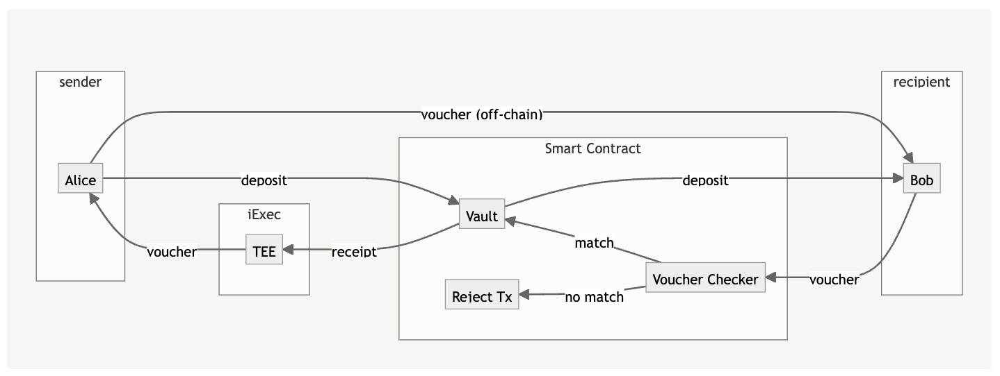

# tee-peanut

Private payment links in the Peanut Protocol (https://peanut.to) using the iExec's Trusted Execution Environment ([https://docs.iex.ec](https://docs.iex.ec/for-developers/confidential-computing/intel-sgx-technology)) to protect the inputs, computation and outputs.

## Overview

The goal of this PoC is to check viability of private transactions on public blockchains by using iExec’s TEE for generating crypto asset vouchers. These vouchers are signed messages that a deposit has been made to an escrow smart contract. The smart contract will release these funds when this signed message is presented to it. This allows for an off-chain transfer of these vouchers.

Previously, such a transaction would not be private as it could be matched by outsiders by analyzing the transaction history. Each transaction would have a unique ID (the deposit index) which matched sender and claimer in the escrow smart contract.

However, using a TEE makes using the index unnecessary, because the whole process can be replaced with a proof-of-deposit voucher. Such a voucher is generated from an on-chain receipt and reliably proves that the sender has made a deposit. However, the voucher itself does include a deposit index or any other form of ID.

In other words, with iExec’s TEE, the computation required to generate a signed voucher’s signature with the smart contract can be done privately. A iExec’s TEE has end-to-end encryption of all application and user data, ensuring privacy.

## Architecture Reference

### Components

The solution consists of three components:

1. a Solidity escrow smartcontract on Goerli: [link](https://goerli.etherscan.io/address/0x801B9a3121662272844386e1D449dE4867efb43F)
2. a Python iExec TEE app for generating vouchers deployed on Bellecour: [link](https://explorer.iex.ec/bellecour/app/0xd09a816944332207f956e662e3ab178d0347bcf8)
3. a NodeJS app that simulates the interactions and later can be used in frontend app for the depositor and recipient: [link](/main.mjs)

### Workflow diagram

### Worflow description:

https://crosspl-my.sharepoint.com/:x:/g/personal/mikolaj_glinka_cross_pl/EVDmbymMQJBEv-A_bzX3Mh0BNXwILU5jUHmFiFNcuNjgSg

## Install guide

### Main JS app

1. Install [Node.js](https://nodejs.org/en/download/) (v12.16.1)
2. Run `npm install` in the root directory
3. Run `node main.mjs` to start the script

### Smart Contracts

**Notice**: Contract already deployed on Goerli at: check the address above in Architecture Reference / Components.

1. Install Python & python3-venv
2. Create a virtual environment: `python3 -m venv venv` & activate it: `source venv/bin/activate`
3. Install dependencies: `pip install -r requirements.txt`
4. Add .env file with a funded wallet `PRIVATE_KEY` and optionally Etherscan keys
5. Deploy contracts: `brownie run scripts/deploy.py` (optionally, you can specify a network with `--network <network>`)

### TEE

**Notice**:

- Enclave iexec application deployed on Bellecour at: check the address above in Architecture Reference / Components
- Confidential dataset deployed on Bellecour at [link](https://explorer.iex.ec/bellecour/dataset/0xe7d615d87fd6524f7c9d6ac30123c0b8b9eb473c)

To protect the input, computation and results, effectively providing an end-to-end encryption, the following iExec functionalities are used:

1. an app developer secret: [link](https://docs.iex.ec/for-developers/confidential-computing/app-developer-secret)
2. a confidential dataset: [link](https://docs.iex.ec/for-developers/confidential-computing/sgx-encrypted-dataset)
3. requester secrets: [link](https://docs.iex.ec/for-developers/confidential-computing/requester-secrets)
4. results encryption: [link](https://docs.iex.ec/for-developers/confidential-computing/end-to-end-encryption)

More info about confidential computing: [link](https://docs.iex.ec/for-developers/confidential-computing/intel-sgx-technology)

**Useful iExec commands:**

iexec init --skip-wallet \
--create files Dockerfile, sconfiy.sh (with correct image names), src/app.py \
docker login registry.scontain.com:5050 \
chmod +x sconify.sh \
./sconify.sh \
--push to docker hub the built tee image \
iexec app init --tee \
docker pull montenegrohugo/peanut-v0.3:tee-debug | grep "Digest: sha256:" | sed 's/.\*sha256:/0x/' \
docker run -it --rm -e SCONE_HASH=1 tee-hello-world:tee-debug \
--update iexec.json (name, multiaddr, checksum, fingerprint) \
iexec app deploy --chain bellecour \
sed -i 's|"bellecour": {},|"bellecour": { "sms": "https://v7.sms.debug-tee-services.bellecour.iex.ec" },|g' chain.json \
iexec storage init --chain bellecour \
iexec app push-secret --chain bellecour \
iexec app check-secret --chain bellecour \
iexec dataset push-secret --chain bellecour \
iexec dataset check-secret --chain bellecour \
iexec order init --app \
--edit params (tag ["tee"], dataset address) in iexec.json \
iexec order sign --app && iexec order publish --app \
iexec orderbook app <your app address> --dataset <dataset_address> \
iexec order init --dataset \
--edit params (tag ["tee"], app address) in iexec.json \
iexec order sign --dataset && iexec order publish --dataset \
iexec orderbook dataset <your dataset address> --app <app_address> \
